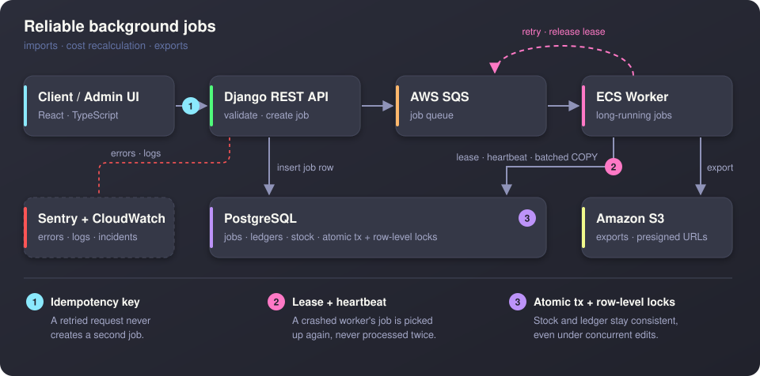

# Hi, I'm Dang (Nguyen Luu Minh Dang) 👋

  
  
  
  

---

## 🧑‍💻 About Me

I'm a **backend-focused Software Engineer** at **TTMI JSC**, shipping production ERP and full-stack operations features used across **50 stores, 500 employees and 4 brands**.

I work where correctness matters most: accounting ledgers, inventory costing, and money. I care about transaction safety, idempotent background jobs, and reports that stay fast on large datasets.

- 🏢 **Now:** Software Developer (Backend-focused) @ TTMI JSC, since Feb 2025
- 🎓 **Studying:** Master's in Information Systems @ UIT, VNU-HCMC (from Aug 2026)
- 🏅 **Graduated:** B.Eng. Software Engineering @ UIT, with Honors (2022 – 2026)
- 🤖 **Workflow:** Codex-assisted development, with reusable prompts and skills I built to validate AI-generated work

---

## 📈 Impact Highlights

| | Result |
|---|---|
| ⚡ **Bulk invoice import** | **3 h → 15 min** for ~7,000 invoice headers (50–100 lines each), by replacing ORM-heavy ingestion with PostgreSQL `COPY`, staged inserts and batched detail processing |
| 🧾 **CRM payment flow** | **~60% faster** order processing with async payment webhooks and automated order state transitions |
| 🔍 **QC batch APIs** | **~55% fewer** SQL queries and **~60% lower** runtime (319-row benchmark), shipped to production |
| 🏬 **ERP scale** | **20 modules** (accounting, inventory, purchasing, sales, CRM, HRM, finance) serving 50 stores and 500 employees |

---

## 💼 Experience

<b>TTMI JSC</b>, Software Developer (Backend-focused) · <i>Ho Chi Minh City · Feb 2025 – Present</i>

 

- **Weighted-average inventory costing engine**: worked with accountants to turn business rules into per-warehouse price calculations, kept in sync across stock documents, inventory movements and accounting entries.
- **Transaction-safe workflows**: atomic transactions and row-level locking keep stock movements and financial ledgers consistent.
- **Resilient async jobs**: AWS SQS + ECS workers with idempotency keys, retries, worker leases and heartbeats, so jobs are never processed twice and failed jobs recover.
- **Fast financial reporting**: ledger, stock, receivables and sales APIs tuned with raw SQL, server-side pagination, selective projections and indexes.
- **Full-stack finance features**: React/TypeScript + Django, with BigInt money aggregation, revision-based optimistic concurrency and scoped permissions.
- **Security & concurrency**: application-scoped token auth with atomic rotation, plus hybrid row locking with version checks for multi-user QC updates.
- **Platform & quality**: diff-based line and branch coverage gate in CI, migration from AWS App Runner to ECS, AWS Batch/S3 exports for reproducing production issues locally, Sentry + CloudWatch Logs for monitoring.
- **CRM platform lead**: led backend development of the internal CRM for orders, customers, payment confirmation and reporting.

<b>CLOUDJET CORPORATE</b>, Backend Engineer · <i>Ho Chi Minh City · Jan 2024 – Jan 2025</i>

 

- Built the **Django REST backend** for an HRM and KPI evaluation platform: employee profiles, departments, KPI cycles, goals, reviews and approvals.
- Designed normalized PostgreSQL schemas with approval history and audit logs, and **role-based access control** for admins, HR, managers and employees.
- Implemented weighted KPI scoring, department summaries and notification workflows.
- Built **async Excel/PDF report generation** on AWS SQS + ECS, and optimized dashboard APIs.

---

## 🏗️ How I Build Reliable Background Jobs

A simplified view of the pattern I use for long-running ERP jobs:

  

---

## 🛠️ Tech Stack

  
   
  

| Area | Tools |
|---|---|
| **Backend & APIs** | Django, Django REST Framework, ASP.NET Core, RESTful APIs, webhooks, OpenAPI |
| **Data** | PostgreSQL, SQL Server, `COPY`, raw SQL, indexing, query optimization, transactions, row-level locking |
| **Cloud & DevOps** | AWS SQS, ECS, Batch, S3, CloudWatch Logs, Docker, GitHub Actions, Sentry, CI/CD |
| **Frontend** | React, TypeScript, Vitest, Playwright, Cloudflare |
| **Practices** | Pytest, unit and API testing, coverage gates, Codex-assisted development, AI output validation |
| **Domains** | ERP, accounting, inventory, financial reporting, HRM/KPI, CRM, QC, concurrency control, idempotent background processing |

---

## 📌 Open Source

- 🧰 [**agent-playbook**](https://github.com/NLMDang22520190/agent-playbook): reusable skills for AI coding agents (Claude Code, Codex, OpenCode). It covers clarifying by reversibility, proof for every claim, 3-role TDD with git gates, and project learnings.

---

## 📊 GitHub Stats

  
  
  

 

  

